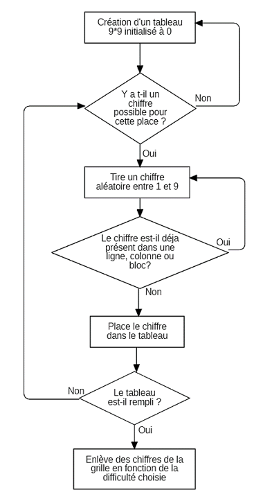

# Projet - Création du Sudoku en C

Les membres de l'équipe:
* [Camille BAYON DE NOYER](https://github.com/Kamomille)
* [Julien GOUBAN](https://github.com/juliengouban)

Durée du projet : 5 mois

## Démonstration du jeu 

## Conception

Diagramme des cas d’utilisation de notre sudoku

## Fonctionnement

### Fonctionnement général

Etape 1 : Générer une grille de sudoku aléatoire

Etape 2 : Générer l'interface graphique

Etape 3 : Gestion des événements "click" du joueur

### Génération de la grille

Etape 1 : Créer un tableau de dimension 9x9

Etape 2 : Créer 3 fonctions pour rechercher si un chiffre est présent dans une ligne, puis dans une colonne puis dans une case

Etape 3 : Placer des chiffres aléatoirement en respectant ces 3 règles

Etape 4 : Si on ne peut plus placer de chiffre dans une case alors on recommence les étapes précédentes jusqu’à ce le remplissage intégral de la grille

Etape 5 : Enlever aléatoirement des chiffres de la grille, le nombre de chiffre à enlever dépend du niveau de difficulté choisit par l’utilisateur

#### Statistique

Moyenne du temps pour créer une grille valide : 10,6 ms

### Techniques
* Utilisation de thread
* Librairie graphique : SDL

